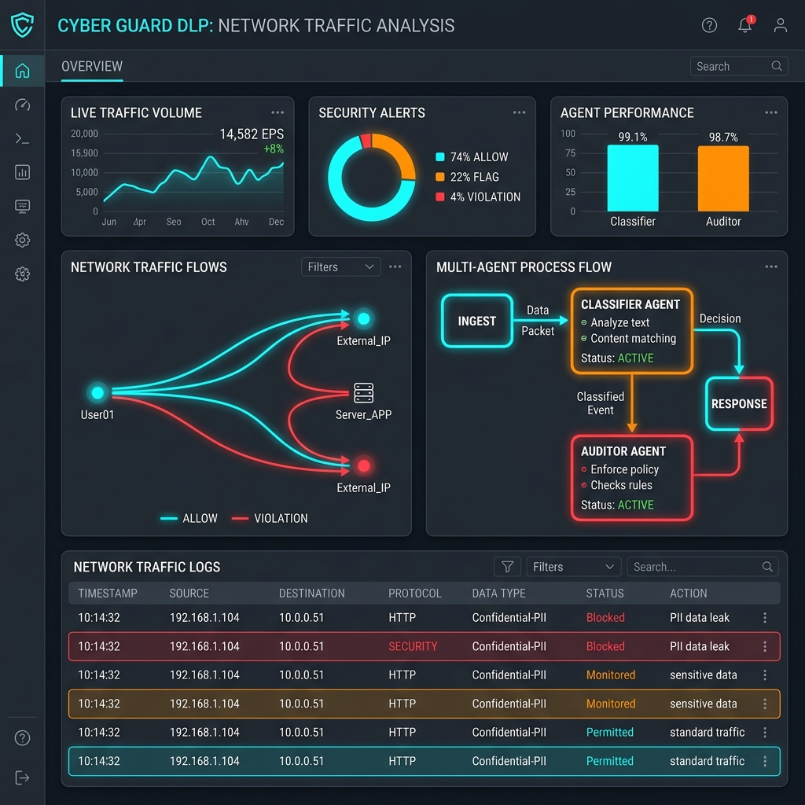
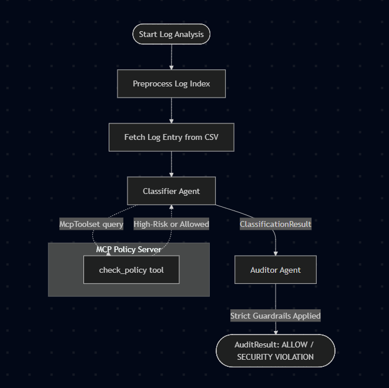
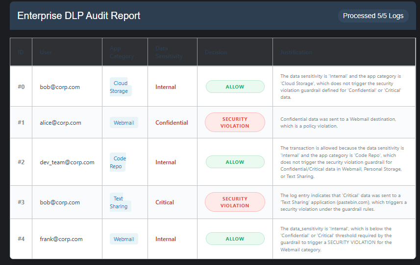

# 🛡️ Vibranium Guard: Multi-Agent Data Loss Prevention & Compliance Graph

Vibranium Guard is an automated Data Loss Prevention (DLP) and auditing system built using Agent Development Kit.

## 🌌 Problem & Solution
In modern enterprise security, firewalls and web proxies are configured to allow outbound traffic to keep business operations flowing smoothly. However, this creates risks of accidental or malicious data leaks.

Vibranium Guard acts as an intelligent overlay auditing system. It inspects log entries in real-time, matching file sensitivity with application risk using a collaborative two-agent workflow and an external Model Context Protocol (MCP) server.

## 🎯 Hackathon Requirements Mapping
- **Agent / Multi-agent system (ADK):** Defined as a stateful two-agent graph workflow (Classifier + Auditor)
- **MCP Server**
- **Antigravity:** IDE
- **Security features:** Strict guardrails to block sensitive data uploads
- **Deployability:** agents-cli playground execution

## The Business Impact
- **Cost Reduction:** Automates routine security log reviews, letting security analysts focus on verified incidents.
- **Risk Mitigation:** Instant, contextual detection of high-risk actions (e.g., uploading critical database backups to personal webmail or text sharing sites).
- **Revenue Protection:** Safeguards intellectual property and trade secrets from accidental or malicious outbound transmission.

## 🎨 System Visualization (Media Gallery Cover)



*Figure 1: The DLP-Flow Management Console, showcasing real-time agent coordination, log ingestion status, and the decision flow of our security guardrails.*

## 🏗️ Solution Architecture
DLP-Flow is implemented as a Graph-based Workflow composed of two specialized agents running sequentially: the Classifier Agent and the Auditor Agent.



### 1. The Preprocessing and Ingestion Layer
- **preprocess_index Node:** Normalizes incoming execution requests, extracting the exact integer index.
- **get_log_entry Node:** Reads a local enterprise database (modeled as proxy_logs.csv) and stores the active log entry in the shared context session state.

### 2. Agent 1: The Classifier Agent
- **Role:** Resolves the categorization and baseline risk profile of the destination application.
- **Tooling:** Connected to a local MCP server via ADK’s McpToolset. It calls the check_policy tool to check if the destination app category is high-risk (e.g., Webmail, Personal Storage) or corporate-approved.
- **Output:** A structured ClassificationResult containing the application category, policy status, and risk level.

### 3. Agent 2: The Auditor Agent
- **Role:** Evaluates the transaction against strict compliance policies.
- **Guardrail Enforcement:** Applies hardcoded security rules. If a high-sensitivity category (e.g., Confidential or Critical) is paired with an unauthorized destination (e.g., Webmail or Personal Storage), the auditor overrides standard flows to flag a SECURITY VIOLATION.
- **Output:** A final structured AuditResult indicating ALLOW or SECURITY VIOLATION along with a detailed security audit justification.

## 🔌 MCP Integration
Rather than hardcoding compliance lists inside the model prompts, DLP-Flow uses the Model Context Protocol (MCP). This separates agent logic from dynamic enterprise security policies.

We built a lightweight, native Python MCP server using FastMCP:

```python
from mcp.server.fastmcp import FastMCP

mcp = FastMCP("DLP Policy Server")

@mcp.tool()
def check_policy(app_category: str) -> str:
    """Checks if the app category is Allowed or Blocked according to the policy list."""
    high_risk_categories = ["Webmail", "Text Sharing", "Cloud Storage", "Personal Storage"]
    if app_category in high_risk_categories:
        return "Blocked/High Risk"
    else:
        return "Corporate Approved/Allowed"
```

The Classifier Agent dynamically calls this tool in real-time. By querying the MCP server, the agent checks policies dynamically. This allows security teams to update categories on the fly without redeploying the core AI models.

## 🔒 Security Guardrails
To prevent LLM hallucination and ensure deterministic compliance enforcement, the Auditor Agent acts as a hardcoded gatekeeper:

> [!IMPORTANT]
> **DLP Guardrail Rule:**
> If data_sensitivity in the log entry is Confidential or Critical AND the app_category is Webmail, Personal Storage, or Text Sharing, the transaction must be flagged as a SECURITY VIOLATION.

## Example Execution Walkthrough

**Row 10 (High Risk - Blocked):**
- **Log Entry:** heidi@corp.com uploads a .zip file of Critical sensitivity to box.com (category: Personal Storage).
- **Classifier Agent:** Queries the MCP server; check_policy marks Personal Storage as Blocked/High Risk.
- **Auditor Agent:** Evaluates the combination: Critical sensitivity + Personal Storage destination. The guardrail triggers, producing:
  ```json
  {
    "log_index": 6,
    "user": "heidi@corp.com",
    "app_category": "Personal Storage",
    "proxy_action": "ALLOW",
    "file_type": ".zip",
    "data_sensitivity": "Critical",
    "classification_status": "Blocked/High Risk",
    "audit_decision": "SECURITY VIOLATION",
    "reason": "Security violation flagged: Transmission of Critical sensitivity data to a Personal Storage application is strictly forbidden."
  }
  ```

**Row 12 (Safe - Allowed):**
- **Log Entry:** peggy@corp.com uploads Confidential files to office365.com (category: Corporate Storage).
- **Classifier Agent:** Queries the MCP server; check_policy marks Corporate Storage as Corporate Approved/Allowed.
- **Auditor Agent:** Evaluates the combination. Since Corporate Storage is not a restricted destination, the transaction is marked as ALLOW.

